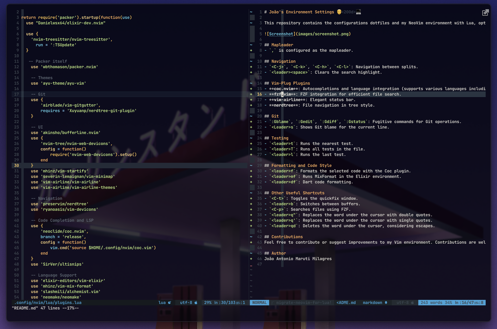
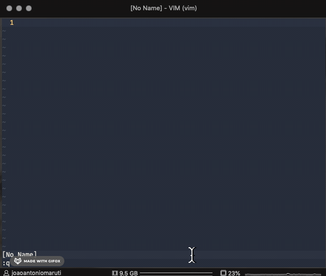
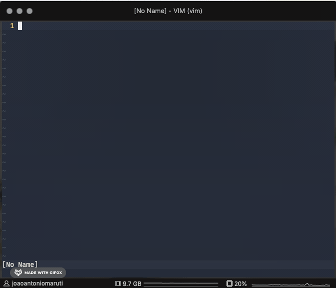
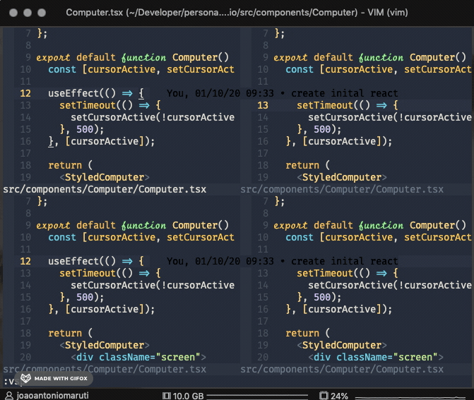
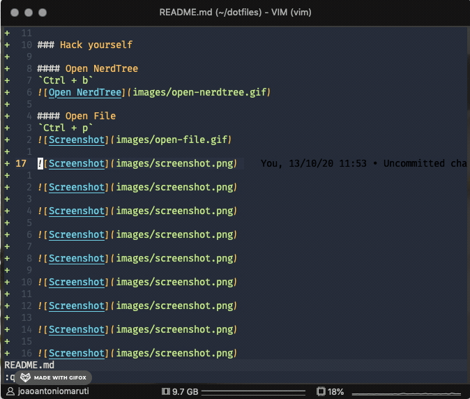
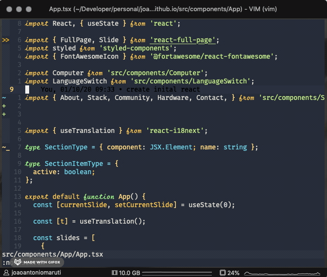
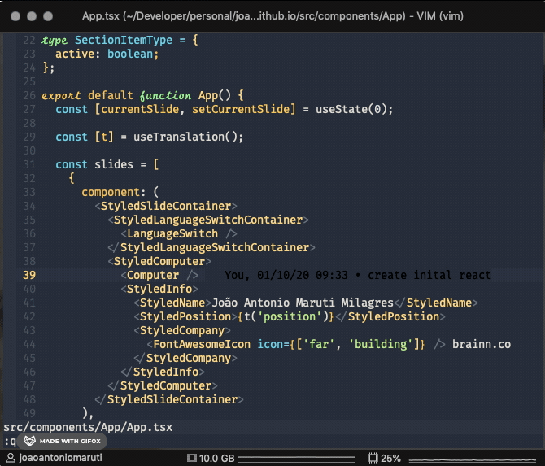
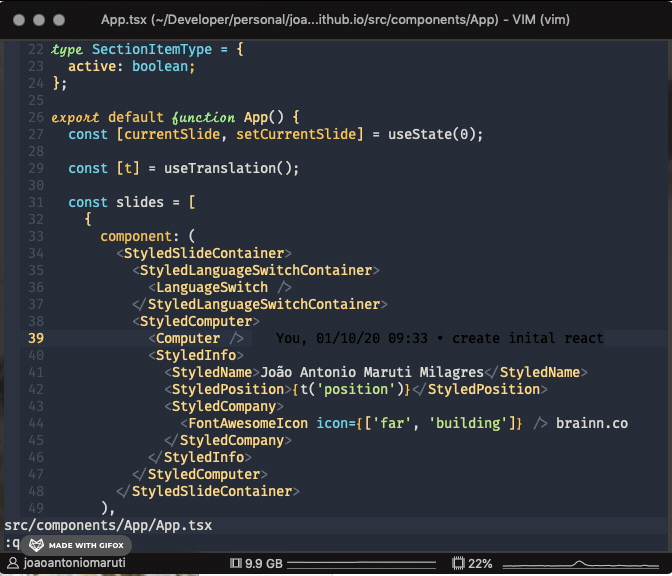

# João's dotfiles 👨‍💻

## Screenshots

## install

## Hacks

#### Open NerdTree

`Ctrl + b`

#### Open File

`Ctrl + p`

#### Split panels navigation

`ctrl + [h, j, k, l]` (like a vim navigation)

#### NerdComments

`<leader> + space + c`

#### Run prettier

`<leader> + p`

#### Go definition with COC

`gd`

#### Split vertical panel and go definition

`gv`

##### Split panel and go definition

`gs`

<!---->

<!---->

<!---->

<!---->

<!---->

## Features

- TypeScript support
- Vim Plug
- React
- styled-components
- Elixir
- GraphQL
- Code navigation
- Font ligatures

## Fonts

Check your term support fonts ligatures

[https://github.com/kencrocken/FiraCodeiScript](https://github.com/kencrocken/FiraCodeiScript)
